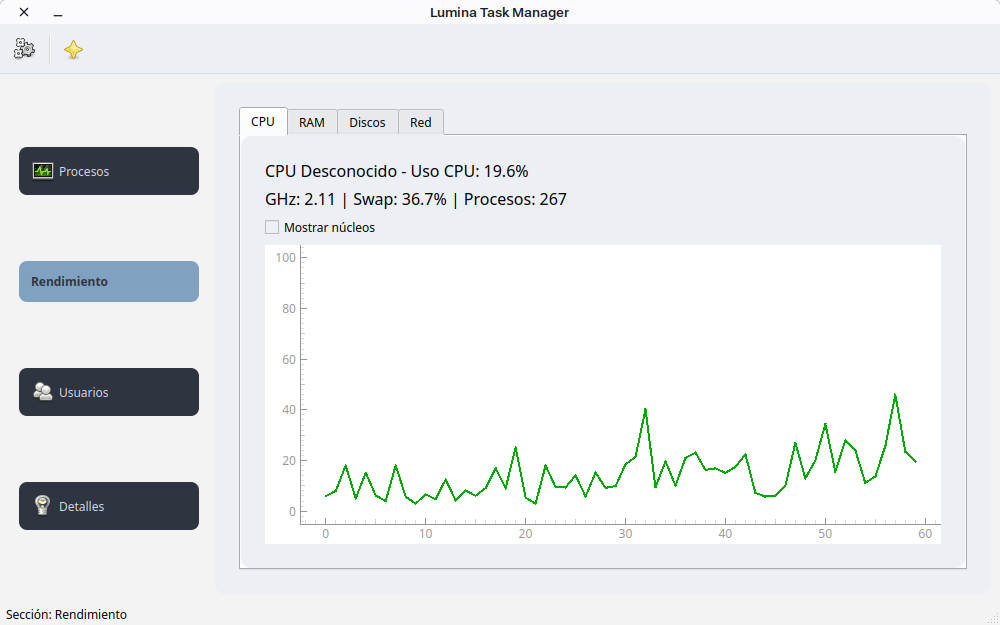
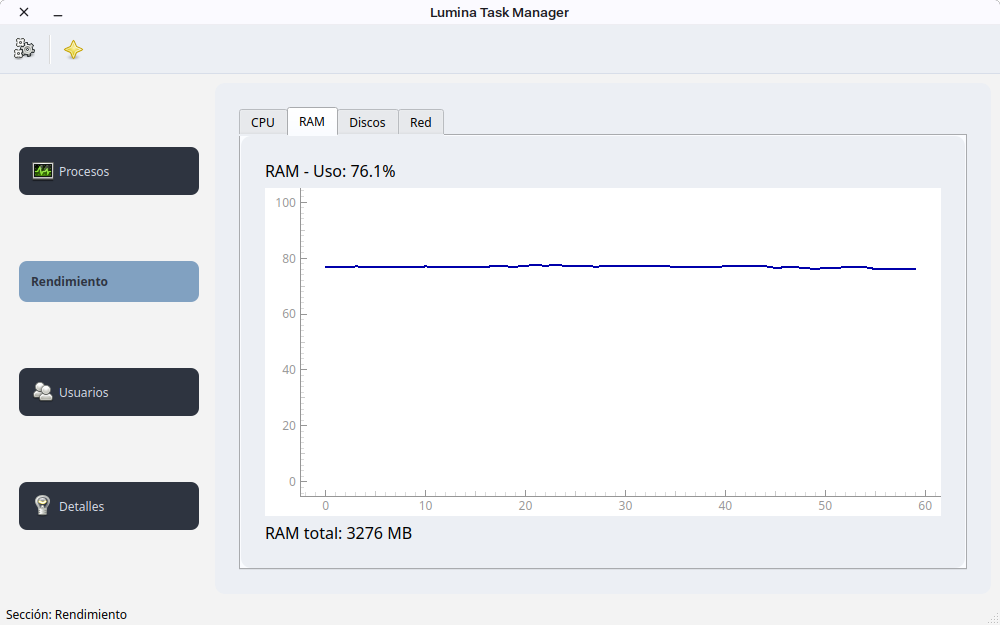
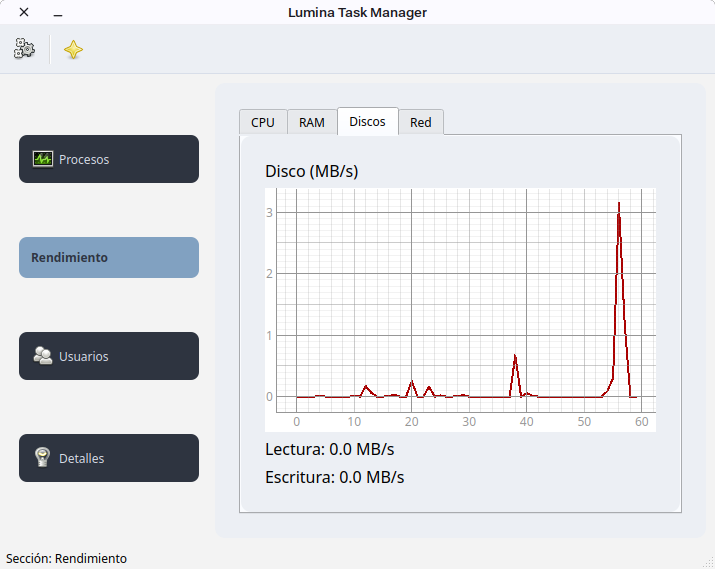

# 🌟 Lumina Task Manager

<div align="center">

**Un monitor de sistema moderno, ligero y hermoso para Linux**


[🎯 Características](#-características) • [📦 Instalación](#-instalación) • [🚀 Uso](#-uso) • [📸 Capturas](#-capturas) • [🤝 Contribuir](#-contribuir)

</div>

---

## 📖 Descripción

**Lumina Task Manager** es un monitor de sistema avanzado diseñado específicamente para Linux. Inspirado en el Task Manager de Windows pero optimizado para el escritorio Linux, ofrece una interfaz moderna y minimalista con todas las herramientas que necesitas para supervisar tu sistema.

Construido con **PyQt6** y **PyQtGraph**, combina rendimiento, funcionalidad y diseño hermoso.

---

## ✨ Características

### 🔧 Monitor de Procesos
- ✅ Monitoreo en **tiempo real** de procesos activos
- ✅ Visualización de **CPU** y **RAM** por proceso
- ✅ **Terminar procesos** directamente desde la interfaz
- ✅ Información detallada de cada proceso
- ✅ Búsqueda y filtrado de procesos

### 📊 Rendimiento del Sistema
- ✅ **CPU**: Monitoreo total y por núcleo
- ✅ **Memoria RAM**: Uso en tiempo real con gráficos
- ✅ **Disco**: Velocidad de lectura/escritura (MB/s)
- ✅ **Red**: Monitoreo de ancho de banda (MB/s)
- ✅ **Uptime del sistema**
- ✅ Gráficos dinámicos con PyQtGraph
- ✅ Menú contextual para opciones adicionales

### 👥 Usuarios Conectados
- ✅ Lista de usuarios activos del sistema
- ✅ Terminal, host y hora de login de cada usuario
- ✅ Información de sesiones activas

### ℹ️ Detalles del Sistema
- ✅ Información completa del hardware
- ✅ IP local automáticamente detectada
- ✅ Usuario actual mostrado
- ✅ Build y versión del sistema

### 🎨 Diseño
- ✅ Tema minimalista con **fondo blanco**
- ✅ **Curvas verdes** al estilo Windows Task Manager
- ✅ Interfaz intuitiva y responsiva
- ✅ Iconografía clara y moderna

### 🛠️ Funcionalidades Extra
- ✅ Ejecutar programas directamente desde la aplicación
- ✅ Soporte para temas personalizados
- ✅ Acceso rápido mediante toolbar

---

## 📦 Instalación

### Requisitos Previos
- **Python 3.8+**
- **pip** o **conda**
- Linux (probado en Ubuntu, Fedora, Debian)

### Opción 1: Instalación Rápida con Git

```bash
# Clonar el repositorio
git clone https://github.com/Shinobu-haruto/Lumina-taskmanager.git
cd Lumina-taskmanager

# Instalar dependencias
pip install -r requirements.txt

# Ejecutar
python main.py
```

### Opción 2: Instalación con Python

```bash
# Clonar y navegar al directorio
git clone https://github.com/Shinobu-haruto/Lumina-taskmanager.git
cd Lumina-taskmanager

# Crear entorno virtual (recomendado)
python3 -m venv venv
source venv/bin/activate

# Instalar dependencias
pip install PyQt6 PyQtGraph psutil

# Ejecutar
python main.py
```

### Opción 3: Instalación en Distros Linux

#### Ubuntu/Debian
```bash
sudo apt-get install python3 python3-pip python3-pyqt6
git clone https://github.com/Shinobu-haruto/Lumina-taskmanager.git
cd Lumina-taskmanager
pip install -r requirements.txt
python main.py
```

#### Fedora/RHEL
```bash
sudo dnf install python3 python3-pip
git clone https://github.com/Shinobu-haruto/Lumina-taskmanager.git
cd Lumina-taskmanager
pip install -r requirements.txt
python main.py
```

#### Arch Linux
```bash
sudo pacman -S python python-pip
git clone https://github.com/Shinobu-haruto/Lumina-taskmanager.git
cd Lumina-taskmanager
pip install -r requirements.txt
python main.py
```

---

## 🚀 Uso

### Inicio Rápido

1. **Ejecutar la aplicación**:
   ```bash
   python main.py
   ```

2. **Interfaz Principal**:
   - **Sidebar**: Selecciona entre Procesos, Rendimiento, Usuarios y Detalles
   - **Toolbar**: Acceso rápido a ejecutar programas y ayuda

3. **Pestaña Procesos**:
   - Visualiza todos los procesos en ejecución
   - Haz clic derecho para terminar un proceso
   - Ordena por CPU, RAM, etc.

4. **Pestaña Rendimiento**:
   - Gráficos en tiempo real de CPU, RAM, Disco y Red
   - Información del uptime y IP local
   - Haz clic derecho para más opciones

5. **Pestaña Usuarios**:
   - Consulta usuarios conectados
   - Ver detalles de sesiones activas

6. **Pestaña Detalles**:
   - Información del sistema
   - Especificaciones de hardware

### Atajos de Teclado
- **Ctrl+Q**: Salir
- **F5**: Refrescar datos

---

## 📸 Capturas





*Interfaz principal con monitor de rendimiento en tiempo real*

---

## 🔧 Dependencias

```
PyQt6>=6.0.0
PyQtGraph>=0.13.0
psutil>=5.9.0
```

Ver `requirements.txt` para más detalles.

---

## 📁 Estructura del Proyecto

```
Lumina-taskmanager/
├── main.py                          # Punto de entrada
├── lumina_taskmanager/
│   ├── main_window.py              # Ventana principal
│   ├── processes.py                # Tab de procesos
│   ├── performance.py              # Tab de rendimiento
│   ├── users_tabs.py               # Tab de usuarios
│   ├── details_tab.py              # Tab de detalles
│   ├── styles.py                   # Estilos CSS/QSS
│   └── utils.py                    # Utilidades
├── requirements.txt                 # Dependencias
├── README.md                        # Este archivo
└── LICENSE                          # MIT License
```

---

## 🤝 Contribuir

¡Las contribuciones son bienvenidas! Si deseas mejorar Lumina Task Manager:

1. **Fork** el repositorio
2. Crea una rama para tu feature (`git checkout -b feature/AmazingFeature`)
3. Commit tus cambios (`git commit -m 'Add some AmazingFeature'`)
4. Push a la rama (`git push origin feature/AmazingFeature`)
5. Abre un **Pull Request**

### Áreas donde podemos mejorar:
- 🐛 Corrección de bugs
- ✨ Nuevas features
- 📚 Mejora de documentación
- 🌍 Traducciones
- 🎨 Mejoras de UI/UX

---

## 🐛 Reportar Bugs

Si encuentras un bug, por favor:
1. Abre un [issue](https://github.com/Shinobu-haruto/Lumina-taskmanager/issues)
2. Describe el problema detalladamente
3. Incluye capturas de pantalla si es posible
4. Indica tu distro Linux y versión de Python

---

## 📝 Changelog

### v1.0.0 (2026-02-21)
- ✅ Lanzamiento inicial
- ✅ Monitor de procesos
- ✅ Gráficos de rendimiento en tiempo real
- ✅ Monitor de usuarios
- ✅ Información del sistema

---

## 📄 Licencia

Este proyecto está bajo la **MIT License** - ver el archivo [LICENSE](LICENSE) para detalles.

---

## 👤 Autor

**Shinobu Haruto**

- GitHub: [@Shinobu-haruto](https://github.com/Shinobu-haruto)
- Proyecto: [Lumina Ecosystem](https://github.com/Shinobu-haruto)

---

## 🌟 Dale una Estrella

Si te gusta este proyecto, ¡dale una ⭐ en GitHub! Ayuda a que más personas lo descubran.

---

## 📚 Recursos Útiles

- [Documentación de PyQt6](https://www.riverbankcomputing.com/static/Docs/PyQt6/)
- [PyQtGraph Documentation](http://www.pyqtgraph.org/)
- [psutil Documentation](https://psutil.readthedocs.io/)

---

<div align="center">

**Hecho con ❤️ para la comunidad Linux**

[⬆ Volver arriba](#-lumina-task-manager)

</div>
