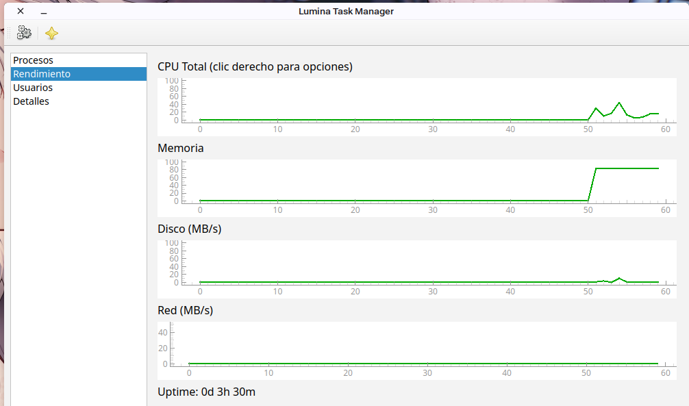

# Lumina Task Manager

**Lumina Task Manager** es un monitor de sistema avanzado y ligero, inspirado en Windows Task Manager, diseñado para **Linux** con **PyQt6** y **PyQtGraph**. Permite supervisar procesos, rendimiento, usuarios conectados y detalles del sistema, con un diseño minimalista y moderno.

---

## 🔹 Características

- Monitor de **procesos activos** con CPU, RAM y opción de terminar procesos.
- **Rendimiento en tiempo real**:
  - CPU total y por núcleo (opcional con menú contextual)
  - Memoria RAM
  - Disco (MB/s)
  - Red (MB/s)
  - Uptime del sistema
  - IP local
- Lista de **usuarios conectados** con terminal, host y hora de login.
- Información del sistema y detalles de cada proceso.
- Tema minimalista con **fondo blanco** y curvas verdes al estilo Windows.
- Compatible con ejecución de programas desde la aplicación.
- **Lumina Edition Build:** 2601 Build: 2125
- Usuario actual mostrado automáticamente.

---
## Preview

## 🔹 Instalación

1. Clonar el repositorio:

```bash
git clone https://github.com/tu_usuario/lumina-taskmanager.git
cd lumina-taskmanager
